author: Ignacio Aragón Polo
id: Bastionado-BIOS
categories: Bastionado,Bios,seguridad
environments: Web
status: Published

# Bastionado de Bios

## Introducción
Duration: 0:04:00

### ¿Que es una BIOS/UEFI?

La **BIOS** (Basic Input Ouput System) o sistema básico de entrada y salida,
es un código insertado en un chip de memoria no volátil en las placas base,
y que es lo primero que se ejecuta cuando encendemos un ordenador.

Negative
: Actualmente los equipos han reemplazado la BIOS por **UEFI** (Unified Extensible
Firmware Interface) o Interfaz de Firmware Extensible Unificada, cuya finalidad
es la misma pero añade mejoras y funciones a la antigua BIOS.

Positive
: Las mayores diferencias entre ambas son una interfaz más moderna y actualizada
frente al diseño MS-DOS de la BIOS de siempre.

Las mejoras más destacadas son las siguientes:
* Interfaz mas moderna y mejorada, incluso puede usarse ratón en algunas versiones.
* Carga más rapida del sistema.
* Compatibilidad de sistema de archivos GPT.
* Mejor y mayor seguridad durante el inicico del ordenador.
* Compatibilidad nativa con sistemas con procesadores de 64 bits.

Esta guia se va a centrar en las diferentes medidas y opciones de seguridad que disponemos:

* **Opciones de Seguridad.**
1. Contraseña de Administrador.
2. Contraseña de Power-On.
3. TPM.
4. Restaurar valores de Fábrica.

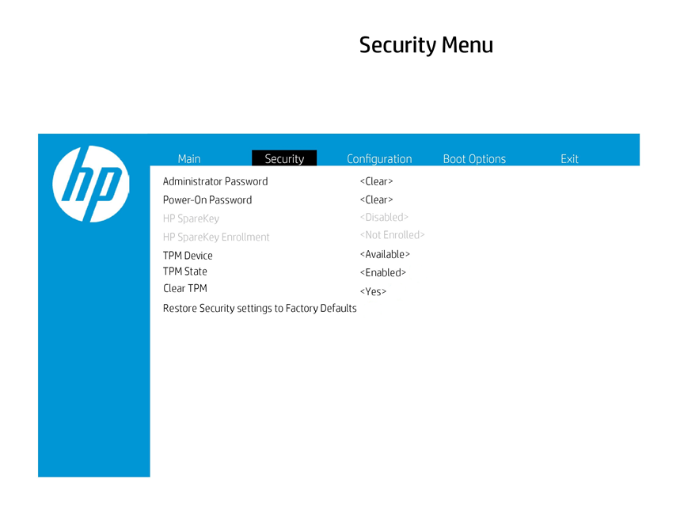

* **Opciones de Arranque.**
1. POST Hotkey Delay (Sec)
2. USB Boot.
3. Secure Boot.
4. Network Boot.

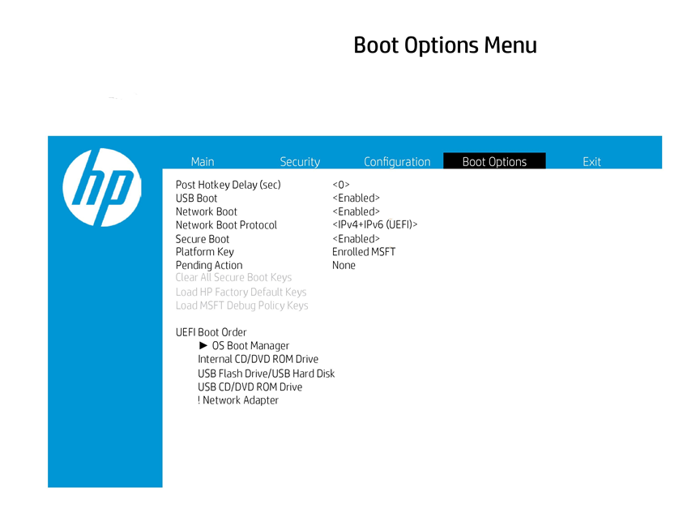

## Contraseña de Administrador
Duration: 0:02:00

Esta opción previene del acceso no autorizado a la BIOS.

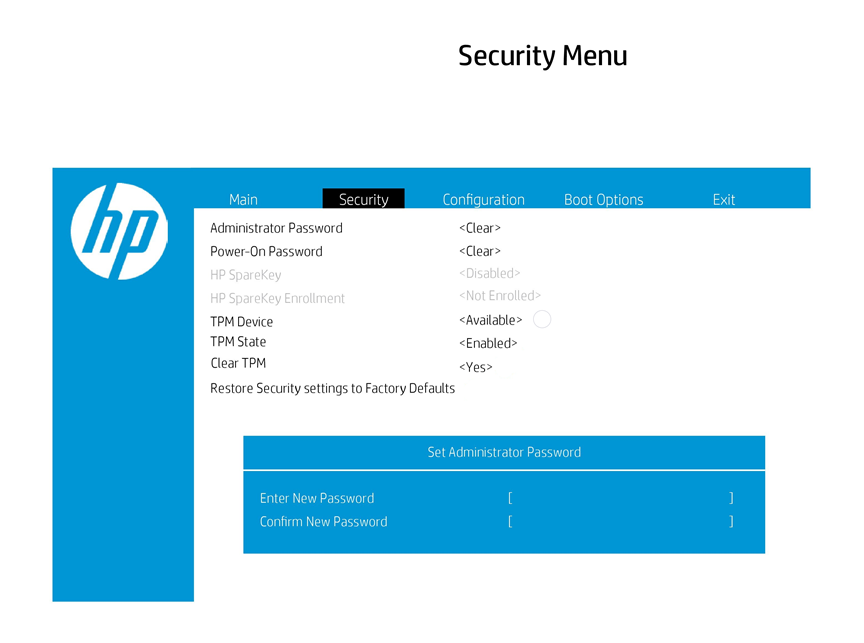

## Contraseña de Power ON
Duration: 0:02:00

Esta opción previene del acceso no autorizado al arranque del sistema.

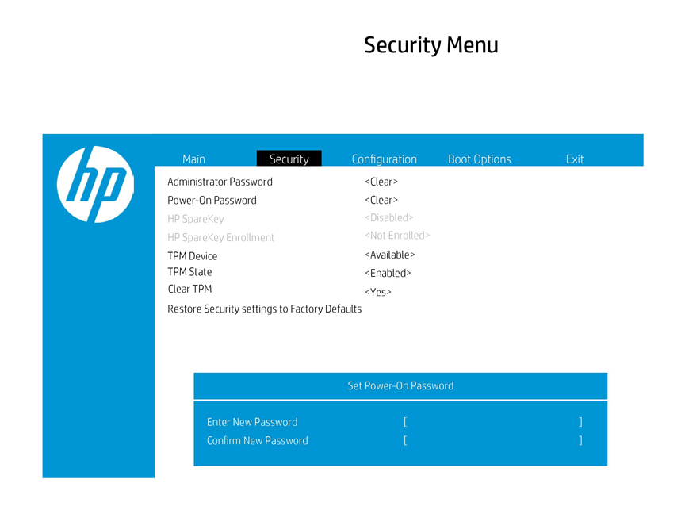

## TPM.
Duration: 0:04:00

**TPM** o **Trusted Plataform Module** (Tecnología de módulo de plataforma segura), es un procesador de criptografia seguro, que incluye varios mecanismos de seguridad que hacen que, aunque haya malware o virus en el equipo no supongan ningún riesgo ni alteraciones en el mismo.

Existen varias opciones:

1. **TPM Device:**

* Oculto.
* Disponible.

Si se dispone en Oculto, el dispositivo TPM no será visible para el Sistema Operativo.

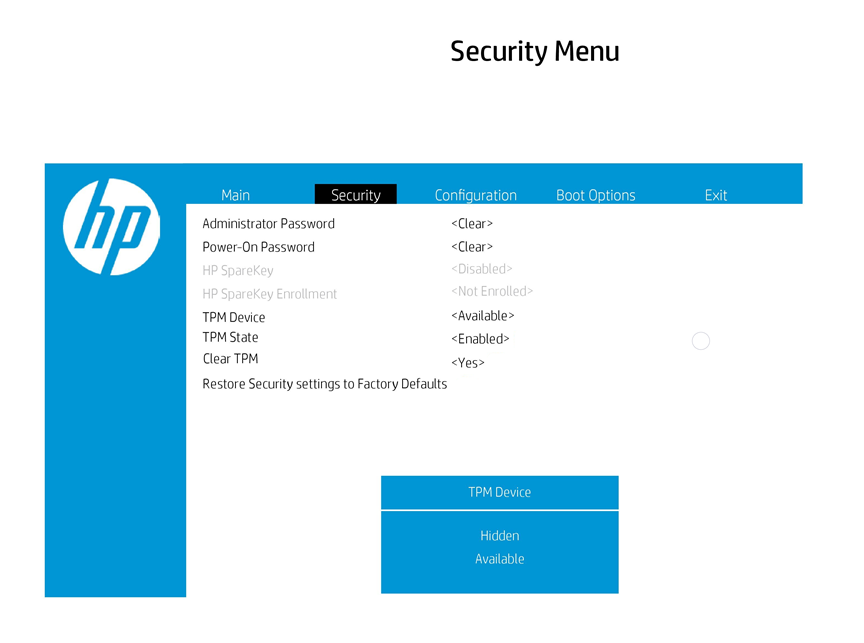

2. **TPM Estate:**

* Activado.
* Desactivado.

Si la configuración del dispositivo TPM se establecide en Oculto, la BIOS oculta este elemento.

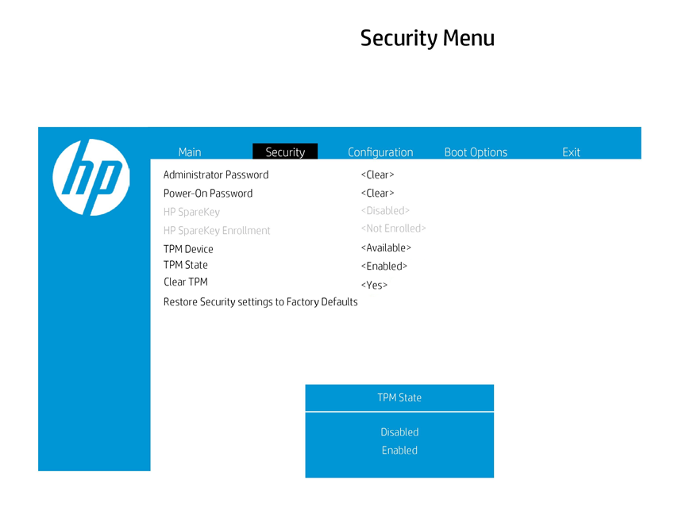

3. **Clear TPM.**

* Si.
* No.

Esta opción nos permite borrar claves y datos protegidos por el TPM.

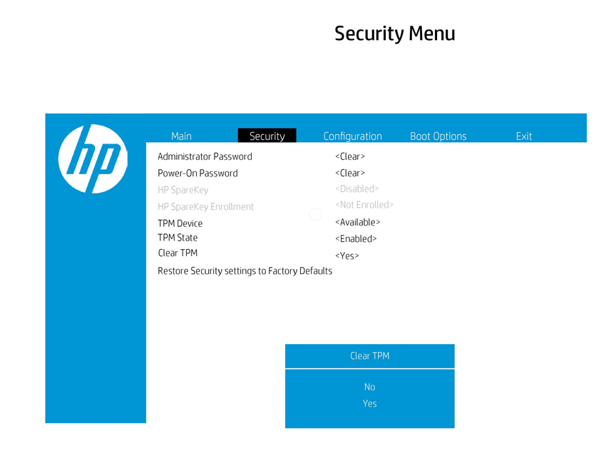

## Restaurar valores de Fábrica

Esta opción restaurará todas las configuraciones de seguridad a los valores predeterminados de fábrica.

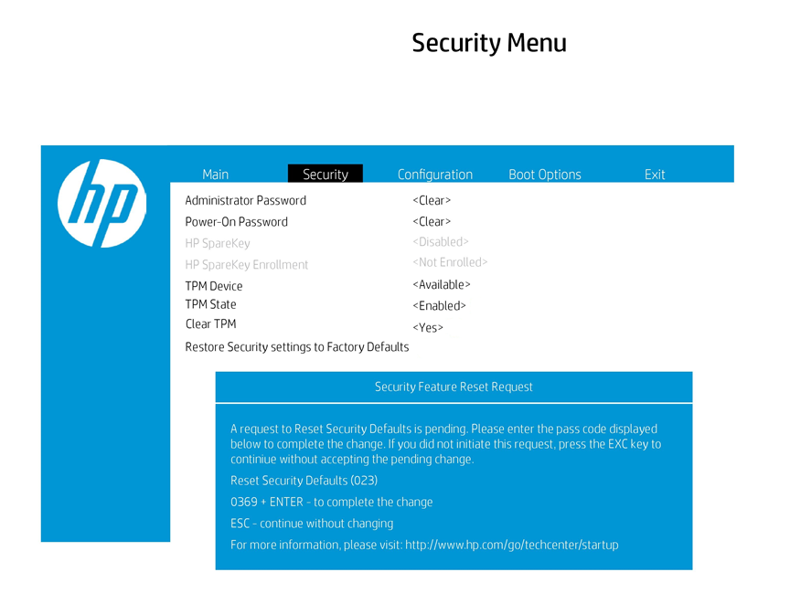

## Post Hotkey Delay (Sec).
Duration: 0:02:00

**POST** o **Power On Self Test** es es una serie de procesos y comprobaciones del sistema que ejecuta una ordenador y sus dispositivos electrónicos cada vez que se enciende o se reinicia.

Esta serie de procesos se basan en escaneos que verifican el hardware y aseguran que tanto el procesador como la RAM y los principales dispositivos como la placa base y el almacenamiento están correctamente y han sido iniciados sin problemas.

El POST Hotkey Delay controla la cantidad de tiempo que se da para presionar la tecla de función para ingresar a las utilidades de configuración cuando se inicia el sistema. 
Para deshabilitar la solicitud audible (pitidos) tanto para la contraseña del administrador como para la contraseña de arranque, seleccione la opción en 0.

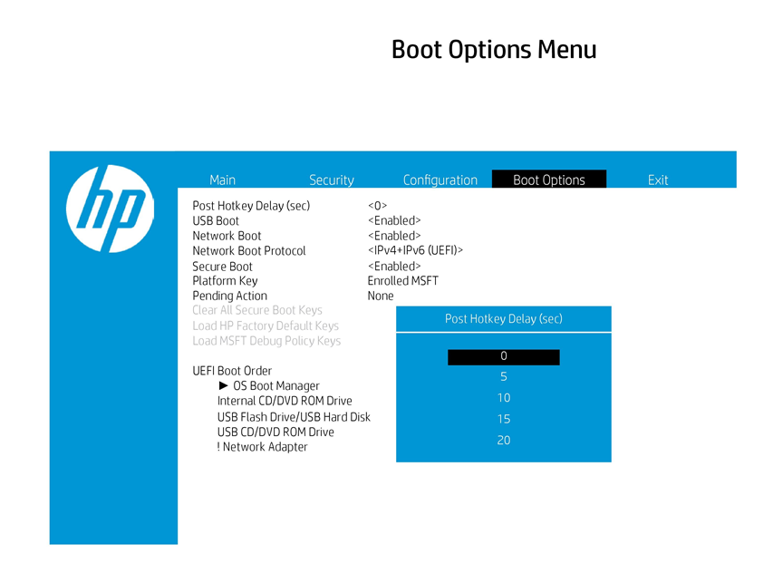

## USB Boot
Duration: 0:02:00

Esta opción activa o desactiva la posibilidad de arrancar el sistema desde un USB externo.

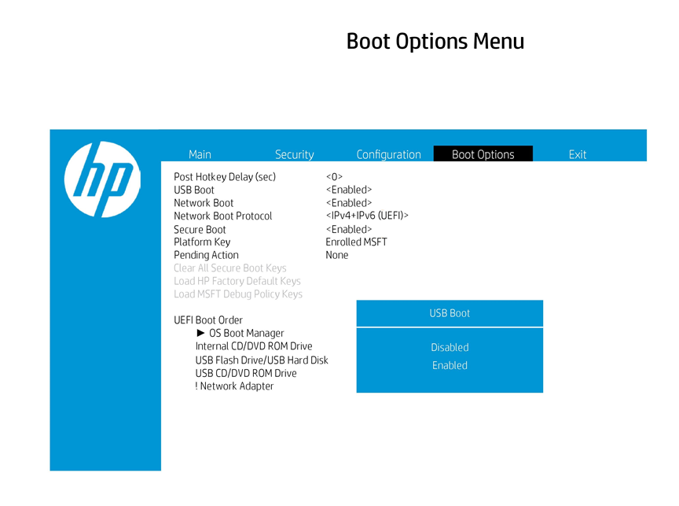

## Secure Boot
Duration: 0:02:00

Es un modo para UEFI que trae Windows desde Windows 8, y que impide la ejecución de cualquier software no firmado o certificado en el arranque del sistema. Con ello se intenta evitar la carga de malware o aplicaciones que no sean de fiar cuando inicias el ordenador.

Esta opción permite activar o desactivar el arranque seguro de la BIOS.

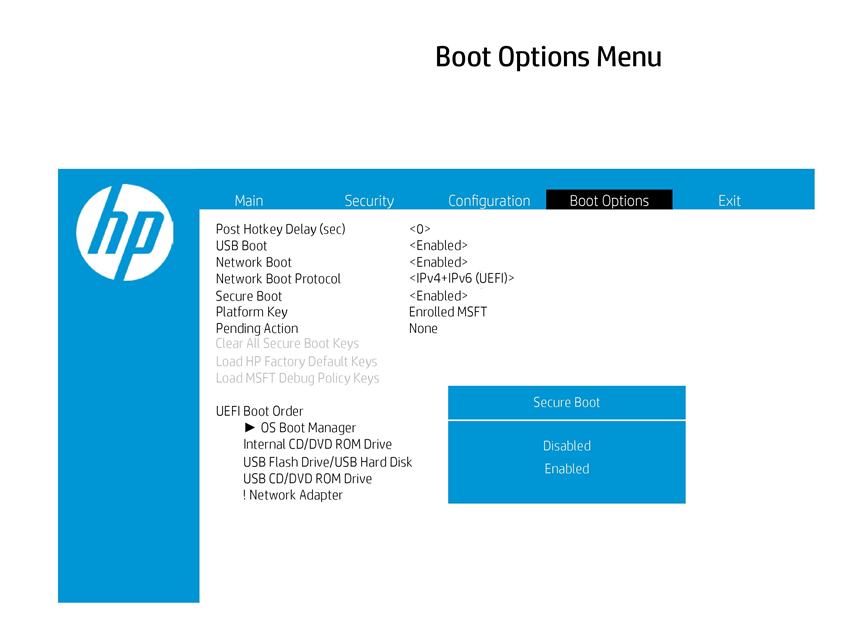

## Network Boot
Duration: 0:02:00

Es un proceso que permite que una ordenador inicie y cargue un sistema operativo u otro programa directamente desde la red sin ningún dispositivo de almacenamiento conectado localmente, como un disquete, un CD-ROM, una memoria USB. o disco duro.

Esta opcion no spermite habilitar o desactivar esta funcion a la vez que protocolo de red utilizaremos.

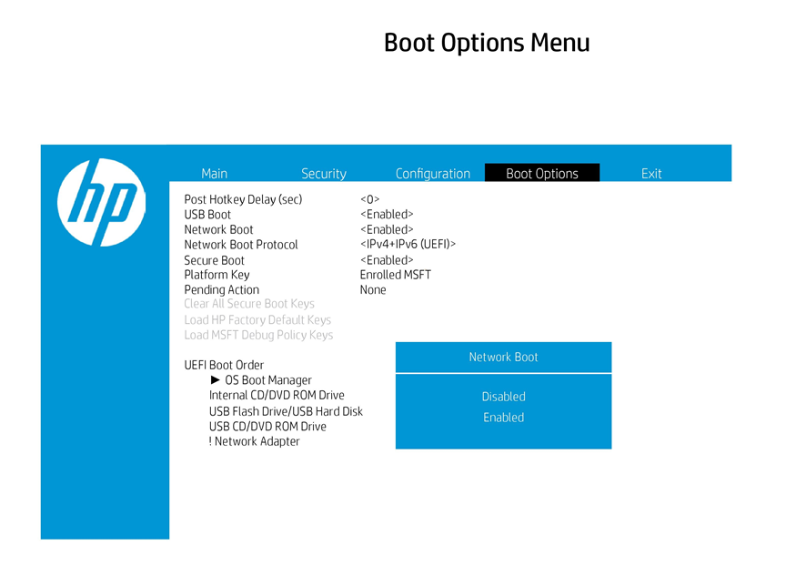

## Menu de salida
Una vez realizados los cambios en la sopciones de la BIOS, tendremos tres opciones: 

* Guardar los cambios y salir. 

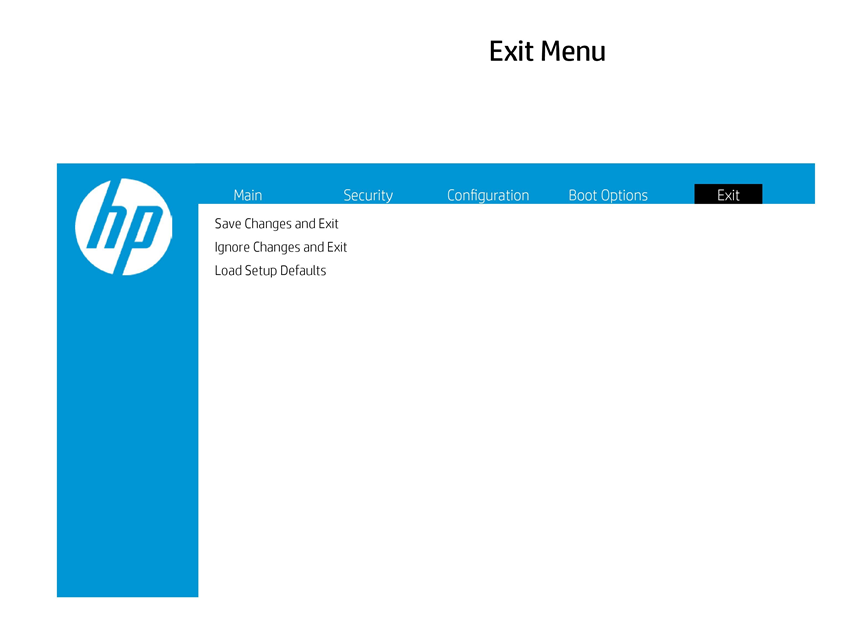

* Ignorar los cambios y salir.

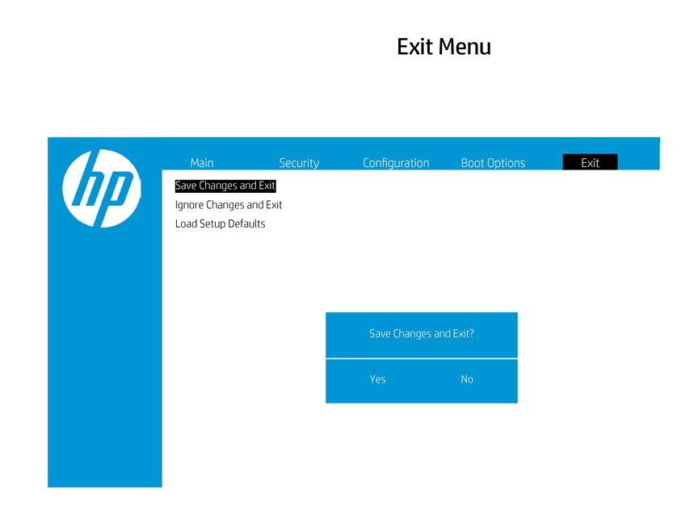

* Cargar las opciones predeterminadas. 

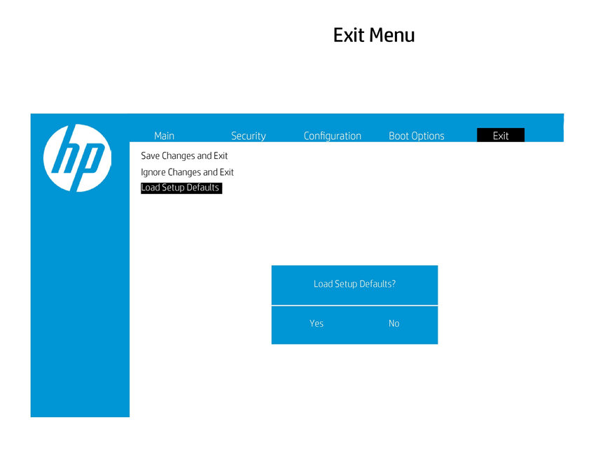

En todas ellas el equipo se reiniciará.